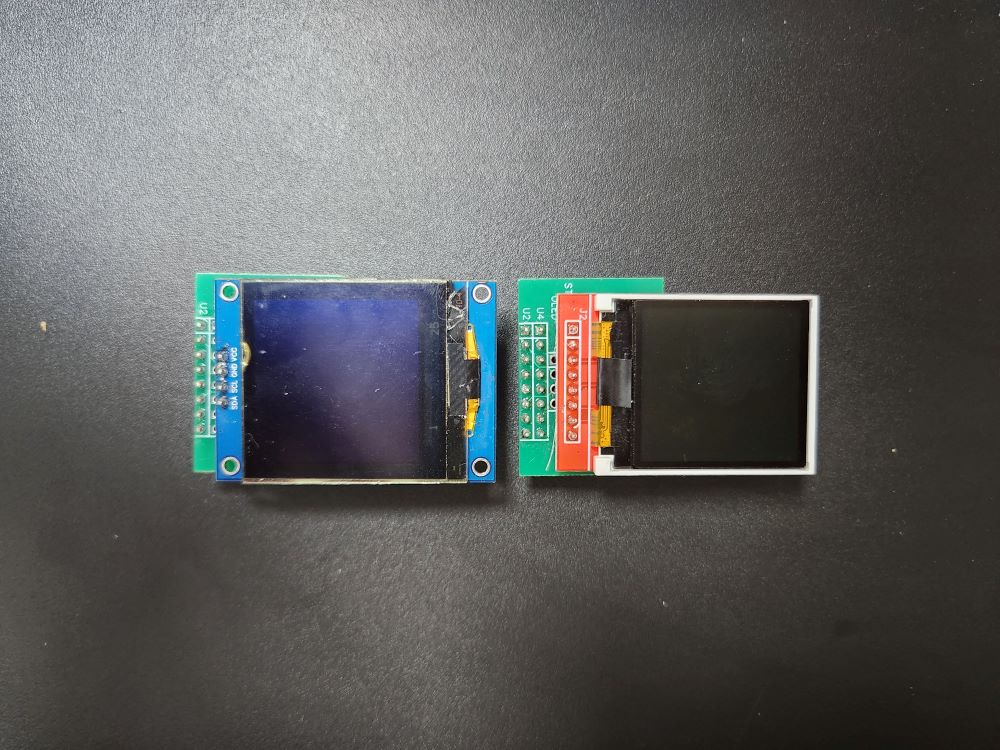
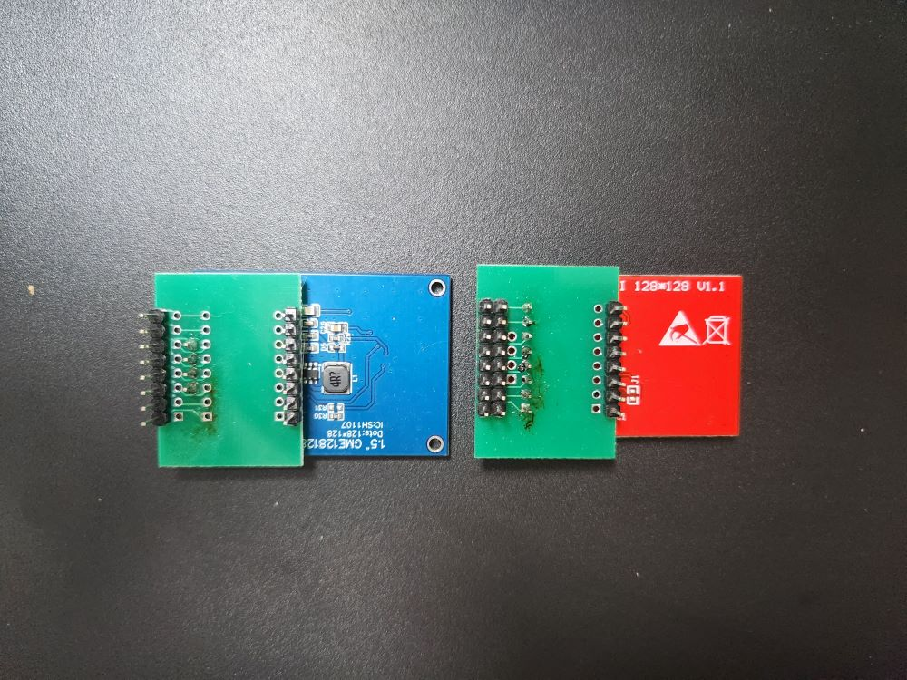
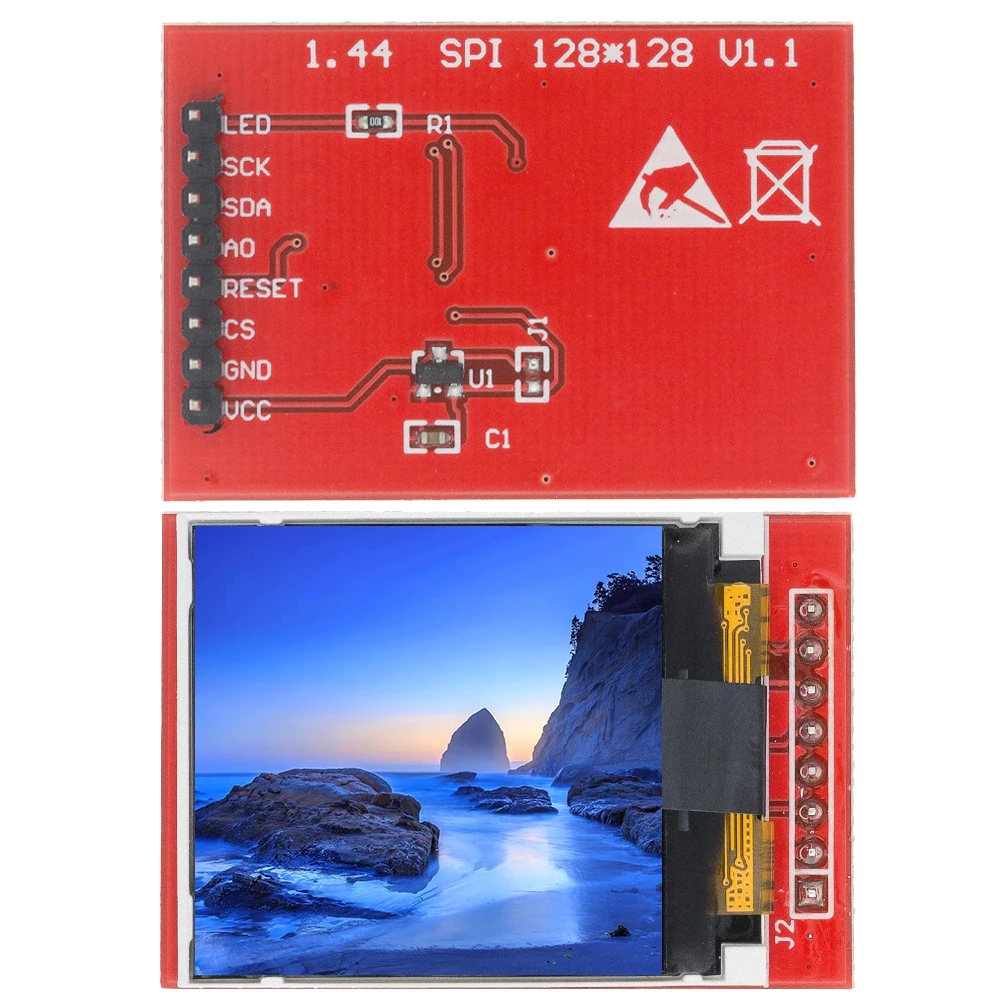
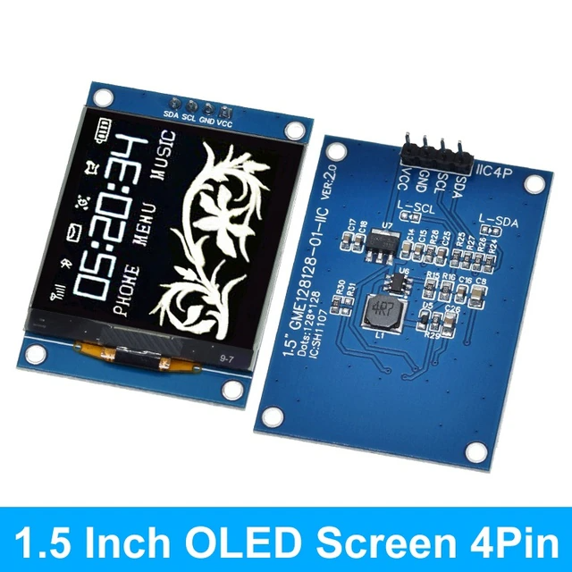

# Airgradient-Display-Adapter
Airgradient Display Adapter

  
## Build Instruction

- Order Display Adapter PCB
  - https://oshwlab.com/luxflow/oled
- Order Display
  - **TFT Display (Recommended)**
    - Pros
      - no burn-in
      - Cheap
      - Multi color
    - Cons
      - **You need replace D1 mini with [Wemos S2 mini](https://www.wemos.cc/en/latest/s2/s2_mini.html) in order to use TFT Dispaly**
    - 1.44 TFT Display (128x128), Red PCB, 8pin
    - 
  - OLED Dispaly
    - Pros
      - You can use stock D1 mini
    - Cons
      - burn-in 
      - more expensive
    - 1.5 OLED (128x128), Blue PCB, 4pin
    - 
- Solder PCB
- Change Firmware
  - For TFT Display
    - use air-gradient-tft.yaml
  - For OLED Display
    - use air-gradient-oled.yaml
  - Change value according to your environment
    - api.encryption.key
    - ota.password
    - wifi.ap.password
- Print Case
  - For TFT Display
    - Use case/1.44 TFT Upper.stl
  - For OLED Display
    - Currently not available
